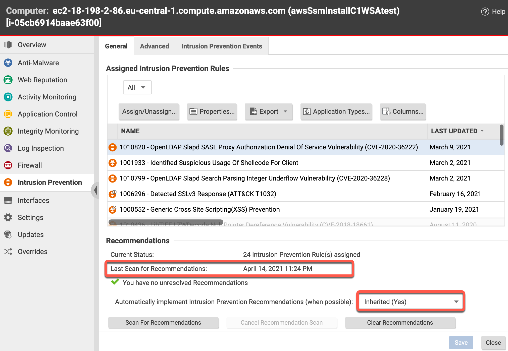

## Born Secure
This repo describes how Trend Micro Cloud One Workload Security can ensure that new EC2 instances in AWS are created with 7 different security controls enabled and a recommendation scan that is automatically 
This not only "virtually patches" the endpoint, it also assign appropriate rules for Intrusion Prevention, Integrity Monitoring, Log Inspection and Anti Malware.

This setup leverages AWS Systems Manager to automatically deploy the Trend Micro Cloud One Workload Security Agent (C1WSA) to any EC2 that has specific tags.   
This happens at the creation of the EC2 instance or later when the matching tag is added (in that case, the EC2 requires a reboot to load the AWS SSM agent)  

## Configure AWS Systems Manager
#see also: https://cloudone.trendmicro.com/docs/workload-security/aws-systems-manager/#protect-your-computers  

## Create AWS SSM Parameters for Trend Micro Cloud One Workload Security  
AWS Services -> AWS Systems Manager (-> Get started with Systems Manager) -> Parameter store -> Create parameter  
Create the following 4 parameters as indicated below the screenshot  
  
```
NAME:				VALUE:
dsActivationUrl 	dsm://agents.deepsecurity.trendmicro.com:443/
dsManagerUrl 	        https://app.deepsecurity.trendmicro.com:443
dsTenantId 	        <your_tenant_id> (see agent deployment script)
dsToken                 <your_ds_token> (see agent deployment script)
```

## Create a Distributor
AWS -> Systems Manager -> Distributor -> Third Party -> TrendMicro-CloudOne-WorkloadSecurity -> Install on a Schedule  
  
 
## Create Association
The numbers refer to the screenshots below:  
		1. name: (e.g.) DistributorForDsaForC1ws  
		2. Action: Install  
		3. Installation Type: In-place update  (!change this from the default setting)   
		4. Name: TrendMicro-CloudOne-WorkloadSecurity  
		5. Targets: Specify instance tags  
		6.	Tag key: c1ws  
		7.	Tag value: enabled   
		8.	"ADD" (dont forget to click the Add button !!)  
		keep everything else default  
		9. Create Association    
 

  
  
  
 

In the next screen, Select the Association you just created -> click "View Details" -> Execution history (tab) -> Success (this can take a while)  


## Create an instanceProfile for SSM  

To provide the needed rights for AWS Systems Manager to actually manage the EC2 instances, an "instance profile" needs to be attached to the EC2 instance.  An instance profile is basially a wrapper around an IAM role.  So we will:
1. create a Role
2. attach the required policies to it (to give it permissions)
3. create an Instance Profile
4. attach the Role to the Instance Profile
5. at creation time of new EC2 instances, this Instance Profile needs to be assigned to the EC2


```
export AWS_INSTANCEPROFILE_FOR_SSM='instanceProfileForSSM'
export AWS_SERVICEROLE_FOR_SSM='ServiceRoleForSSM'  #this is an existing Role

cat  <<-EOF  >./SSMassumeRolePolicy.json
{
  "Version": "2012-10-17",
  "Statement": {
    "Effect": "Allow",
    "Principal": { "Service": "ec2.amazonaws.com" },
    "Action": "sts:AssumeRole"
  }
}
EOF
 
aws iam create-role --role-name ${AWS_SERVICEROLE_FOR_SSM} --assume-role-policy-document file://./SSMassumeRolePolicy.json

aws iam attach-role-policy --role-name ${AWS_SERVICEROLE_FOR_SSM} --policy-arn  arn:aws:iam::aws:policy/AmazonSSMManagedInstanceCore

aws iam attach-role-policy --role-name ${AWS_SERVICEROLE_FOR_SSM} --policy-arn arn:aws:iam::aws:policy/AmazonSSMPatchAssociation

aws iam create-instance-profile --instance-profile-name ${AWS_INSTANCEPROFILE_FOR_SSM}

aws iam add-role-to-instance-profile --instance-profile-name ${AWS_INSTANCEPROFILE_FOR_SSM} --role-name ${AWS_SERVICEROLE_FOR_SSM}

```

## Create a keypair
Create a keypair or use an existing one
```
export AWS_KEYNAME="myKeyPair
aws ec2  create-key-pair --key-name ${AWS_KEYNAME}
```

## Create and auto-protect new instances
AWS Services -> EC2 -> Launch Instance -> 
	Amazon Linux 2 AMI (HVM), SSD Volume Type...  
  

  

  

  

  

  

  

## Connect to the Instance
Now that the AWS SSM agent is installed, we can connect directly to the EC2 instance using the *Session Manager*. (no password nor SSH keypair needed, nor any Security Group)   
    
Wait until the instance has completely initialized, select it and press connect

    
Select the Sessions Manger tab and notice that the "Connect" button is available.  
Click it  

     
Once connected, verify that the Deep Security Agent is running.
  

Verify if the Cloud One Workload Security agent is running
```
sudo ps -ef | grep ds_
```
Check the logs of the AWS SSM agent  
```
   sudo less /var/log/amazon/ssm/amazon-ssm-agent.log
```
To see if the SSM agent is online, run:
```
    curl http://169.254.169.254
 ```

To restart the AWS agent, run
``` 
     sudo systemctl restart amazon-ssm-agent
```
   
Go to Cloud One Workload Security and verify that the Computer is protected.


If you have an event-based task that, upon creation of the image, auto-assigns a policy that has "Perform ongoing Recomendation Scans" turned on, then a recommendation scan is triggered as soon as the new instance comes online.


Results of a recommendation can be auto-assigned to the instances


## Using the steps outlined above, new EC2 instances can be "born secure"


## Important Notes for other platforms

This procedure requires that the *AWS SSM agent* is available in the AMI.  This is the case for most AMIs.  

The Trend Micro plugin for AWS SSM requires that the *AWS cli* is available in the AMI.  This is *not* always the case.  e.g. Ubuntu and Windows images do not come with the AWScli.  However it can esaliy be installed using userdata.  

Below are examples on how to do that for Ubuntu (20) and Windows (2016)

### Create user-data file for ubuntu images
Creating the userdata:
```
cat <<EOF >${AWS_PROJECT}_user-data.sh
#!/bin/bash
sudo snap install aws-cli --classic
PATH=/snap/bin:$PATH
EOF
```

### Instantiate an Ubuntu20 instance   
```
aws ec2 run-instances --subnet-id ${SNID1} --security-group-ids ${SGID1} --image-id $AWS_AMI_UBUNTU20_ID --count 1 --instance-type t2.micro --user-data file://${AWS_PROJECT}_user-data.sh --iam-instance-profile Name=${AWS_INSTANCEPROFILE_FOR_SSM} --key-name $AWS_KEYNAME  

aws ec2 create-tags --resources ${$AWS_EC2_UBUNTU20_ID} --tags Key=Name,Value=${AWS_PROJECT}Ubuntu20 Key=${TAGKEY1},Value=${TAGVALUE1} Key=${TAGKEYSSM},Value=${TAGVALUESSM}  

```


### Create the user-data file for Windows images
```
cat <<EOF > ${AWS_PROJECT}_user-data-win.ps1
<powershell>
mkdir c:\temp
[Net.ServicePointManager]::SecurityProtocol = [Net.SecurityProtocolType]::Tls12
Invoke-WebRequest -Uri "https://awscli.amazonaws.com/AWSCLIV2.msi" -UseBasicParsing -outfile c:\temp\AWSCLIV2.msi
dir c:\temp\AWSCLIV2.msi
Start-Process msiexec -argumentlist '/i "c:\temp\awscliv2.msi" /qb /l*v C:\temp\awscliv2install.log'
</powershell>
EOF
```

### Instantiate a Windows Server 2016
```
aws ec2 run-instances --image-id $(aws ssm get-parameters --names /aws/service/ami-windows-latest/Windows_Server-2016-English-Full-Base  --query 'Parameters[0].[Value]' --output text) --subnet-id ${SNID1} --security-group-ids ${SGID1} --user-data file://${AWS_PROJECT}_user-data-win.ps1  --iam-instance-profile Name=${AWS_INSTANCEPROFILE_FOR_SSM}  --key-name $AWS_KEYNAME --count 1 --instance-type m4.large   

aws ec2 create-tags --resources $AWS_EC2_WIN2016_ID --tags Key=Name,Value=${AWS_PROJECT}Win2016 Key=${TAGKEY1},Value=${TAGVALUE1}  Key=${TAGKEYSSM},Value=${TAGVALUESSM}
```