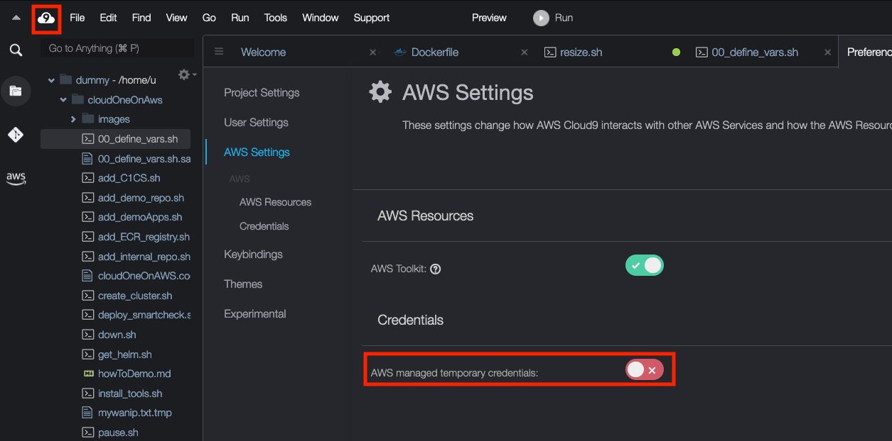
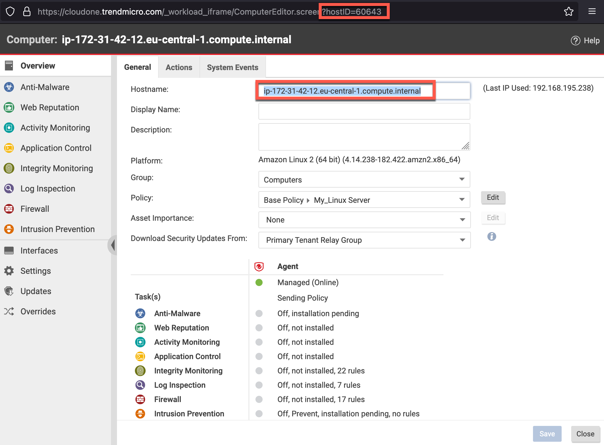

# This project has been deprecated in June 2022

∏◊https://cloudone.trendmicro.com/?disable-accountsv2## Born Secure
This repo describes how Trend Micro Cloud One Workload Security can ensure that new EC2 instances in AWS are created with 7 different security controls enabled and a recommendation(/vulnerability) scan that is started automatically
This not only "virtually patches" the endpoint, it also assigns appropriate rules for Intrusion Prevention, Integrity Monitoring, Log Inspection and Anti Malware.

This setup leverages AWS Systems Manager to automatically deploy the Trend Micro Cloud One Workload Security Agent (C1WSA) to any EC2 instance that has specific tags.   
This happens at the creation of the EC2 instance or later when the right tag is added (in that case, the EC2 requires a reboot to load the AWS SSM agent)  

## Configure AWS Systems Manager
#see also: https://cloudone.trendmicro.com/docs/workload-security/aws-systems-manager/#protect-your-computers  

## Login to the AWS Console
  - go to https://console.aws.amazon.com and login to the AWS console as ab IAM user (do not use your root account)
  - select the region you want to work in (from the dropdown at the right top of the screen)

## Create AWS SSM Parameters for Trend Micro Cloud One Workload Security  
AWS Services -> enter "AWS Systems Manager" in the search bar  (-> Get started with Systems Manager) -> in the left margin, select "Parameter store"  -> Create parameter  
Create the following 4 parameters as indicated below the screenshot  
  
```
NAME:				VALUE:
dsActivationUrl 	dsm://agents.deepsecurity.trendmicro.com:443/
dsManagerUrl 	        https://app.deepsecurity.trendmicro.com:443
dsTenantId 	        <your_tenant_id> (see your Cloud One Workload Security agent deployment script; the format is something like XX1111X1-1XX1-11X1-1X11-X111XXX11111)
dsToken                 <your_ds_token> (see agent deployment script)
```

## Create a Distributor
In the left margin, choose "Distributor" (AWS -> Systems Manager -> Distributor ) -> open the "Third Party" tab -> select the "TrendMicro-CloudOne-WorkloadSecurity" package (don't click on the link of the package, just select it with the radio button) -> click the button "Install on a Schedule"  
  

## Create Association
The numbers refer to the screenshots below:  
		1. name: (e.g.) DistributorForDsaForC1ws  
		2. Action: Install  
		3. Installation Type: In-place update  (!change this from the default setting)   
		4. Name: TrendMicro-CloudOne-WorkloadSecurity  
		5. Targets: Specify instance tags  
		6.	Tag key: c1ws  
		7.	Tag value: enabled   
		8.	"ADD" (dont forget to click the Add button !!)  
		keep everything else default and scroll all the way down to the end of the page  
		9. click the "Create Association" button    


  
  
  


In the next screen, Select the Association you just created (don't click on the link, just select it with the radio-button) -> at the top of the screen click the "View Details" button -> go to the  "Execution history" tab -> Wait till you see "Success" (this can take a while)  


## Setup an AWS Cloud9 environment
The following steps can also be done from the AWS Console, but we want to use the AWS Command line Interface (AWSCLI) as this is easier to replicate later.  We will run the AWS CLI from a Cloud9 desktop. 

  - go to Cloud9 (in the search bar enter "Cloud9")
  
  - Create an Environment
  - Give it a name to your liking and click "Next Step"  
  - As indicated in the screenshot below, make the following selections
  - select `Create a new EC2 instance for environment (direct access)`
  - use `t3.small`
  - use **Ubuntu Server 18.04 LTS**
    
  - tag it to your liking (tags are good)
  - use default settings for the rest (click "Next Step" and "Create Environment")
  - The creation of the new environment may take 2-3 minutes.  Occasionally we have seen where the enviroment could not be created.  In that case, delete it an create a new one (AWS -> Services -> Cloud9 -> My Enviroments)
  


## Disable the AWS-managed temporary credentials
In the Cloud9 environment, go to the Cloud9 menu bar and click on the AWS Cloud9 tab (it shows the number 9 in a cloud icon).   If you don't see the menu bar as indicated in the screenshot below, hover the mouse over the top of the window. The menu bar should roll down and become visible.  Go to -> Preferences -> scroll down and expand "AWS Settings" (not AWS Configuration)-> Credentials -> uncheck "AWS managed temporary credentials"


## Configure AWS CLI with your keys and region
   
```shell
aws configure
```

Please set `Default region` to the region you're working on and default the output format to `json`.

```shell
AWS Access Key ID [****************GT7G]:   type your AWS Access Key here
AWS Secret Access Key [****************0LQy]:  type your AWS Secret Access key here
Default region name [eu-central-1]:    Configure your region here
Default output format [json]:          Set default output to json
```

## Create an instanceProfile for SSM  

To provide the needed rights for AWS Systems Manager to actually manage EC2 instances, an "instance profile" needs to be attached to the EC2 instance.  An instance profile is basially a wrapper around an IAM role.  So we will:
1. create a Role
2. attach the required policies to it (to give it permissions)
3. create an Instance Profile
4. attach the Role to the Instance Profile
5. at creation time of new EC2 instances, this Instance Profile needs to be assigned to the EC2

run the following commands to create an Instance Profile
```
# set a few variables
export AWS_INSTANCEPROFILE_FOR_SSM='instanceProfileForSSM'
export AWS_SERVICEROLE_FOR_SSM='ServiceRoleForSSM'   
# create the json file to define the permissions
cat  <<-EOF  >./SSMassumeRolePolicy.json
{
  "Version": "2012-10-17",
  "Statement": {
    "Effect": "Allow",
    "Principal": { "Service": "ec2.amazonaws.com" },
    "Action": "sts:AssumeRole"
  }
}
EOF

# create a Role
aws iam create-role --role-name ${AWS_SERVICEROLE_FOR_SSM} --assume-role-policy-document file://./SSMassumeRolePolicy.json

# attach the permissions/policy to the role 
aws iam attach-role-policy --role-name ${AWS_SERVICEROLE_FOR_SSM} --policy-arn  arn:aws:iam::aws:policy/AmazonSSMManagedInstanceCore

aws iam attach-role-policy --role-name ${AWS_SERVICEROLE_FOR_SSM} --policy-arn arn:aws:iam::aws:policy/AmazonSSMPatchAssociation

# create an instance profile
aws iam create-instance-profile --instance-profile-name ${AWS_INSTANCEPROFILE_FOR_SSM}

# attach the role to the instance profile
aws iam add-role-to-instance-profile --instance-profile-name ${AWS_INSTANCEPROFILE_FOR_SSM} --role-name ${AWS_SERVICEROLE_FOR_SSM}

```

## Create a keypair
Create a keypair or use an existing one
```
export AWS_KEYNAME="myKeyPair"
aws ec2  create-key-pair --key-name ${AWS_KEYNAME}
```

## Create and auto-protect new instances
We will first create an EC2 instance from the Web console and then we will create a few more, using AWS CLI
AWS Services -> EC2 -> Launch Instance ->
	Amazon Linux 2 AMI (HVM), SSD Volume Type...  
  

  

  

  

  

  

  

## Connect to the Instance
Now that the AWS SSM agent is installed, we can connect directly to the EC2 instance using the *Session Manager*. (no password nor SSH keypair needed, nor any Security Group)   

Wait until the instance has completely initialized, select it and press connect


Select the Sessions Manger tab and notice that the "Connect" button is available.  
Click it  


Once connected, verify that the Deep Security Agent is running.
  

Verify if the Cloud One Workload Security agent is running
```
sudo ps -ef | grep ds_
```
Check the logs of the AWS SSM agent  
```
   sudo less /var/log/amazon/ssm/amazon-ssm-agent.log
```
To see if the SSM agent is online, run:
```
    curl http://169.254.169.254
 ```

To restart the AWS agent, run
```
     sudo systemctl restart amazon-ssm-agent
```

Go to Cloud One Workload Security and verify that the Computer is protected.


If you have an event-based task that, upon creation of the image, auto-assigns a policy that has "Perform ongoing Recomendation Scans" turned on, then a recommendation scan is triggered as soon as the new instance comes online.


## Create a new policy to be used in this lab
From the C1WS web UI, go to Policies and right click on the default "Linux Server" policy (which resides under the "Base" policy), then click "duplicate"
Double-click your "Linux Server_2" policy and:
- change the name to your liking
- ensure Anti-malware is enabled
- ensure Intrusion Prevention is enabled with the setting of:
    - "Automatically implement Intrusion Prevention Recommendations (when possible):" to Yes
- save
- before closing the window, take note of the securityProfileID as indicated in the screenshot below.  We will need that ID in the next script


## Create Event-based task (EBT) to activate any newly created computer and assign the policy you just created
To create the EBT, run the script below, but first replace the "parameterValue": 000 by the ID of the policy that you just created.
This curl command will create an EBT that:
- triggers when a new computer is created with a tag of "c1ws" with a value of "enabled"
- the EBT will activate that computer 
- and assign policy with ID 000 (replaced by your ID)

```
curl -s -k -X POST ${C1WSURL}/api/eventbasedtasks -H "api-version: v1" -H "Content-Type: application/json"  -H "api-secret-key: $C1APIKEY" -H 'cache-control: no-cache' \
  -d '{ "name": "myEBT004","type": "computer-created-by-system", "enabled": true, "actions":[ { "type": "activate", "parameterValue": 2 }, { "type": "assign-policy", "parameterValue": 000 }  ],"conditions":[ { "field": "tag", "key": "c1ws", "value": "enabled"}] }'
```

## trigger a recommendation scan on computer with ID xx

Find the ID of the computer you just created as indicated in the screenshot below  


Trigger a recommendation scan:
```
export COMPUTER_ID='60643'
SCHEDULEDTASK_ID=`curl -s -k -X POST ${C1WSURL}/api/scheduledtasks -H "api-version: v1" -H "Content-Type: application/json"  -H "api-secret-key: ${C1APIKEY}" -H "cache-control: no-cache" -d "{ \"name\": \"__created_by_API_-Trigger_Recommendation_Scan\",\"type\": \"scan-for-recommendations\",\"enabled\": true,\"scheduleDetails\": {\"timeZone\": \"UTC\",\"recurrenceType\": \"none\",\"recurrenceCount\": 0,\"onceOnlyScheduleParameters\": {\"startTime\": 0  } }, \"runNow\": \"true\",\"scanForRecommendationsTaskParameters\": {\"computerFilter\": {\"type\":\"computer\",\"computerID\": \"${COMPUTER_ID}\" } } }"| jq -r ".ID"`
echo $SCHEDULEDTASK_ID
```
Verify that the Recommendation Scan is running as indicated below


## Using the steps outlined above, new EC2 instances can be "born secure"


## Important Notes for other platforms

This procedure requires that the *AWS SSM agent* is available in the AMI.  This is the case for most AMIs.  

The Trend Micro plugin for AWS SSM requires that the *AWS cli* is available in the AMI.  This is *not* always the case.  e.g. Ubuntu and Windows images do not come with the AWScli.  However it can esaliy be installed using userdata.  

Below are examples on how to do that for Ubuntu (20) and Windows (2016)

### Create user-data file for ubuntu images
Creating the userdata:
```
cat <<EOF >my_user-data.sh
#!/bin/bash
sudo snap install aws-cli --classic
PATH=/snap/bin:$PATH
EOF
```

### Instantiate an Ubuntu20 instance   
```
aws ec2 run-instances --subnet-id ${SNID1} --security-group-ids ${SGID1} --image-id $AWS_AMI_UBUNTU20_ID --count 1 --instance-type t2.micro --user-data file://my_user-data.sh --iam-instance-profile Name=${AWS_INSTANCEPROFILE_FOR_SSM} --key-name $AWS_KEYNAME  

aws ec2 create-tags --resources ${$AWS_EC2_UBUNTU20_ID} --tags Key=Name,Value=${AWS_PROJECT}Ubuntu20 Key=c1ws,Value=enabled  

```


### Create the user-data file for Windows images
```
cat <<EOF > ${AWS_PROJECT}_user-data-win.ps1
<powershell>
mkdir c:\temp
[Net.ServicePointManager]::SecurityProtocol = [Net.SecurityProtocolType]::Tls12
Invoke-WebRequest -Uri "https://awscli.amazonaws.com/AWSCLIV2.msi" -UseBasicParsing -outfile c:\temp\AWSCLIV2.msi
dir c:\temp\AWSCLIV2.msi
Start-Process msiexec -argumentlist '/i "c:\temp\awscliv2.msi" /qb /l*v C:\temp\awscliv2install.log'
</powershell>
EOF
```

### Instantiate a Windows Server 2016
```
aws ec2 run-instances --image-id $(aws ssm get-parameters --names /aws/service/ami-windows-latest/Windows_Server-2016-English-Full-Base  --query 'Parameters[0].[Value]' --output text) --subnet-id ${SNID1} --security-group-ids ${SGID1} --user-data file://${AWS_PROJECT}_user-data-win.ps1  --iam-instance-profile Name=${AWS_INSTANCEPROFILE_FOR_SSM}  --key-name $AWS_KEYNAME --count 1 --instance-type m4.large   

aws ec2 create-tags --resources $AWS_EC2_WIN2016_ID --tags Key=Name,Value=${AWS_PROJECT}Win2016 Key=${TAGKEY1},Value=${TAGVALUE1}  Key=${TAGKEYSSM},Value=${TAGVALUESSM}
```
