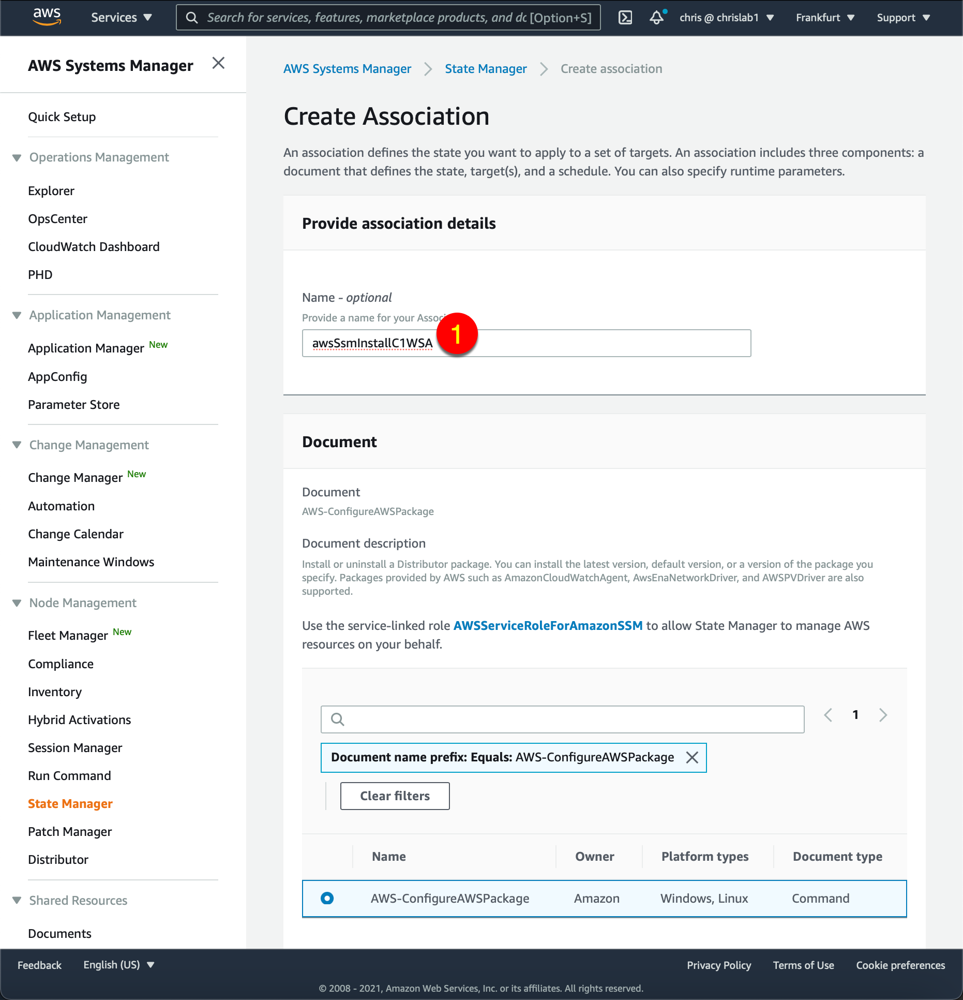

## Introduction
This repo describes how to setup AWS Systems Manager to automatically deploy the Trend Micro Cloud One Workload Security Agent (C1WSA) to any EC2 that has specific tags.   
This would happen at the creation time or later when the matching tag is added (in that case, the EC2 requires a reboot to load the AWS SSM agent)  

## Configure AWS Systems Manager
#see also: https://cloudone.trendmicro.com/docs/workload-security/aws-systems-manager/#protect-your-computers  

### Create AWS SSM Parameters for Trend Micro Cloud One Workload Security  
AWS Services -> AWS Systems Manager (-> Get started with Systems Manager) -> Parameter store -> Create parameter  
Create the following 4 parameters as indicated below the screenshot  
  
```
		NAME:				VALUE:
		dsActivationUrl 	dsm://agents.deepsecurity.trendmicro.com:443/
		dsManagerUrl 	    https://app.deepsecurity.trendmicro.com:443
		dsTenantId 	        <your_tenant_id> (see agent deployment script)
		dsToken             <your_ds_token> (see agent deployment script)
```

### Create a Distributor
AWS -> Systems Manager -> Distributor -> Third Party -> TrendMicro-CloudOne-WorkloadSecurity -> Install on Schedule  
  
 
### Create Association
The numbers refer to the screenshots below
		1. name: (e.g.) DistributorForDsaForC1ws  
		2. Action: Install  
		3. Installation Type: In-place update  
		4. Name: TrendMicro-CloudOne-WorkloadSecurity  
		5. Targets: Specify instance tags  
		6.	Tag key: c1ws 
		7.	Tag value: enabled 
		8.	"ADD" (dont forget to click the Add button !!)
		keep everything else default
		9. Create Association  
		In the next screen, Select the Association you just created -> click "View Details" -> Execution history (tab) -> Success (this can take a while)  

  
  
  
 

### Create an instanceProfile for SSM  
```
export AWS_INSTANCEPROFILE_FOR_SSM='instanceProfileForSSM'
export AWS_SERVICEROLE_FOR_SSM='ServiceRoleForSSM'  #this is an existing Role

cat  <<-EOF  >./SSMassumeRolePolicy.json
{
  "Version": "2012-10-17",
  "Statement": {
    "Effect": "Allow",
    "Principal": { "Service": "ec2.amazonaws.com" },
    "Action": "sts:AssumeRole"
  }
}
EOF
 
aws iam create-role --role-name ${AWS_SERVICEROLE_FOR_SSM} --assume-role-policy-document file://./SSMassumeRolePolicy.json

aws iam attach-role-policy --role-name ${AWS_SERVICEROLE_FOR_SSM} --policy-arn  arn:aws:iam::aws:policy/AmazonSSMManagedInstanceCore

aws iam attach-role-policy --role-name ${AWS_SERVICEROLE_FOR_SSM} --policy-arn arn:aws:iam::aws:policy/AmazonSSMPatchAssociation

aws iam create-instance-profile --instance-profile-name ${AWS_INSTANCEPROFILE_FOR_SSM}

aws iam add-role-to-instance-profile --instance-profile-name ${AWS_INSTANCEPROFILE_FOR_SSM} --role-name ${AWS_SERVICEROLE_FOR_SSM}

```

### Create a keypair
Create a keypair or use an existing one
```
export AWS_KEYNAME="myKeyPair
aws ec2  create-key-pair --key-name ${AWS_KEYNAME}
```

## Create and auto-protect new instances
AWS Services -> EC2 -> Launch Instance -> 
	Amazon Linux 2 AMI (HVM), SSD Volume Type...  
  

  

  

  

  

  

  

## Connect to the Instance
Now that the AWS SSM agent is installed, we can connect directly to the EC2 instance using the Session Manager. (no password nor SSH keypair needed)
Wait until the instance has completely initialized, select it and press connect
	
Select the Sessions Manger tab and notice that the "Connect" button is available.
Click it

Once connected, verify that the Deep Security Agent is running


Go to Cloud One Workload Security and verify that the Computer is protected


If you have an event-based task that, upon creation of the image, auto-assigns a policy that has "Perform ongoing Recomendation Scans" turned on, then a recommendation scan is triggered as soon as the new instance comes online.


